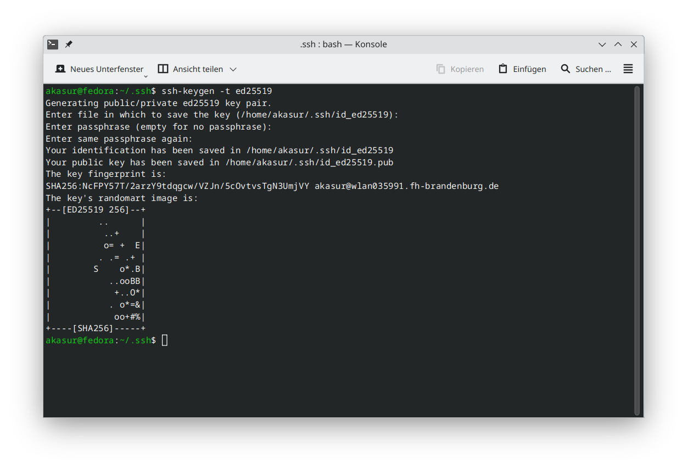
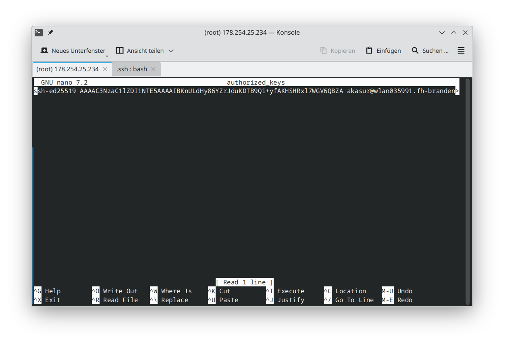
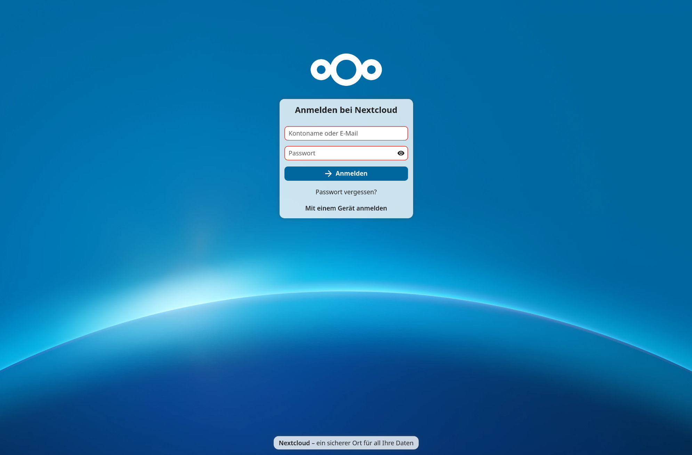

# Dokumentation - Ansible Installation von Nextcloud mit Keycloak Integration

## Voraussetzungen

#### Ansible Control Node:
- Pc mit Linux Betriebssystem oder Windows mit WSL (Windows Subsystem for Linux)
- Ansible kann entweder über den Package Manager oder über pip installiert werden
- Installation von Ansible über den Package Manager:
  ```bash
    sudo apt update
    sudo apt install ansible
    ```
- Installation von Ansible über pip:
  - Installation von pip:
    ```bash
    sudo apt update
    sudo apt install python3-pip
    ```
  - Installation von ansible
    ```bash
    python3 -m pip install --user ansible
    ```

Um die erfolgreiche Installation zu überprüfen, kann folgendes Command genutzt werden:
```bash
ansible --version
```

Für weitere Informationen die Ansible-eigene Installationsseite nutzen:
https://docs.ansible.com/ansible/latest/installation_guide/intro_installation.html
      
  

#### Managed Nodes:
- Linux Betriebssystem
  - In diesem Anwendungsfall arbeiten wir mit Debian 12
- SSH Zugriff auf die Managed Nodes (Per Keypair)

Für die schnelle Einrichtung der Managed Node gibt es das "prepare_system.sh"-Script.
Das Script kümmert sich um folgendes:
- Upgrade des bestehenden Systems auf den neuesten Stand
- Installation benötigter Komponenten
  - curl → Herunterladen des Nextcloud-Archives
  - nano → Editor für die Kommandozeile
  - python → Grundvorraussetzung von Ansible
  - python-apt → Steuerung des Package-Managers via Python

Da Ansible alle Tasks als Python-Code auf den Managed-Nodes ausführt werden für bestimmte Aufgaben
spezifische Python-Module gebraucht.

#### Hinzufügen eines Keypairs für die passwortlose Authentifizierung

Für das Ausführen von Ansible auf der Control-Node ist ein ssh-Zugang für alle Managed-Nodes erforderlich.
Ein neues Keypair für die passwortlose Authentifizierung kann wie folgt angelegt werden:

Erstellen eines ed25519 Keypairs unter Linux:

Im Home-verzeichnis des Users gibt es einen .ssh Ordner. Ist dieser nicht vorhanden, muss dieser erstellt werden:
```bash
mkdir ".ssh"
```
```bash
cd .ssh
```

In dem .ssh Ordner werden Keypairs gespeichert. Hier findest du möglicherweise auch die "known_hosts"-Datei.

Erstelle nun mit folgenden Command ein ed25519 Keypair:
```bash
ssh-keygen -t ed25519
```


Möglich wäre, eine passphrase für das Schlüsselpaar zu hinterlegen. In diesem Beispiel wird keine gesetzt.

Als Nächstes lesen wir unseren public Key des Pairs aus und kopieren diesen:

```bash
cat id_ed25519.pub
```

[!WARNING]

Verbreite nur den public Key, der private Key verbleibt nur auf der Control-Node!

Verbinde dich nun mit der Managed-Node.
erstelle im .ssh Ordner eine Datei namens "authorized_keys" und füge deinen Public Key ein:
```bash
cd ~/.ssh
nano authorized_keys
```


Die Passwortlose Authentifizierung per ssh sollte funktionieren.
Probiere es mit einer neuen Verbindung aus!

## Installation von Nextcloud auf den Managed Nodes

Weitere Informationen zu Ansible:
https://docs.ansible.com/ansible/latest/getting_started/index.html

Für die Installation von Nextcloud auf den Managed Nodes nutzen wir das Playbook 
mit den Namen "nextcloud.yaml".

In einem Playbook stehen alle Aufgaben, die Ansible auf den Managed Nodes ausführen soll.
Das Inventory listet alle Managed Nodes auf, auf denen die Aufgaben ausgeführt werden sollen.

[!IMPORTANT]

In der "inventory.yaml" muss unter "nextcloud_server_ip" die IP-Adresse des Servers eingetragen werden, auf dem Nextcloud installiert werden soll.

Ebenso kann der Name des Admin Users und das Passwort angepasst werden.

Nun kann das Playbook mit folgendem Command ausgeführt werden:
```bash
ansible-playbook -i inventory.yaml nextcloud.yaml
```

Das Playbook besteht aus folgenden Aufgaben:
- Installation von Apache2
- Installation von MariaDB
  - Installation von benötigten PHP-Modulen
- Installation und Konfiguration von Nextcloud

## auf Nextcloud zugreifen

Nach erfolgreichem Durchlauf des Playbooks ist Nextcloud über die IP-Adresse des Servers erreichbar.

Es öffnet sich ein Anmeldefenster, in dem der Admin-User und das Passwort eingegeben werden kann.

Nextcloud ist nun einsatzbereit!
